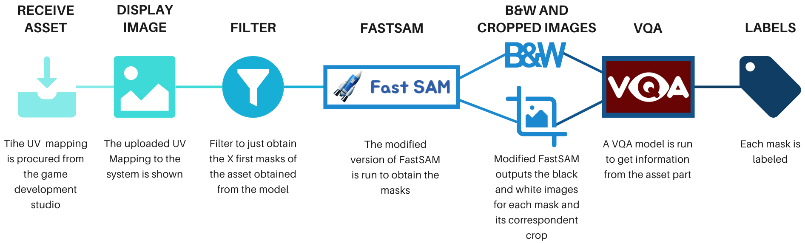

# Automatic Mask Labeling System



## Description
This repository hosts the implementation of the Automatic Mask Labeling System developed by Manuel San Román García for the Capstone Project at IE University. The project leverages advanced technologies including the Segment Anything Model (SAM) and Visual Question Answering (VQA) models combined with Large Language Models (LLMs) to identify and label parts of various assets from different video games automatically.

The system is designed to enhance video game development processes by automating image segmentation and labeling, particularly focusing on the challenges associated with UV mapping images.

## Paper and Presentation
- [Paper](https://drive.google.com/file/d/1JC4-5MVFB3zGC8tumJi0qCNf-wpox8cB/view?usp=sharing)
- [Presentation](https://www.canva.com/design/DAF-7YeRWV4/0CyFNq9ZCojZDMGPwauufw/edit?utm_content=DAF-7YeRWV4&utm_campaign=designshare&utm_medium=link2&utm_source=sharebutton)

## Features
- **Segment Anything Model (SAM)**: Uses SAM for precise image segmentation.
- **Visual Question Answering (VQA)**: Integrates VQA for accurate identification of asset parts.
- **Specialized for Video Games**: Tailored to handle UV mapping images used in video game assets.

## Repository Structure
- **.py files**: Contains all source code for the Automatic Mask Labeling.
- **main.ipynb**: Jupyter notebook that demonstrate the functionality and results of the system for different implementation.
- **output folders**: Contains examples for different implementations.

## Installation
1. Clone the repository:
```bash
git clone https://github.com/manuelsanroman/automatic_mask_labelling.git
cd automatic_mask_labelling
```

2. Create a virtual environment. The code requires python==3.7. Then, install required dependencies:
```bash
# For windows
py -m venv .venv
.venv\Scripts\activate
pip install -r requirements.txt
```

3. Clone the FastSAM repository in the cloned automatic_mask_labelling repository:
```bash
git clone https://github.com/CASIA-IVA-Lab/FastSAM.git
```

4. Download the model checkpoint "FastSAM-x.pt" and place it in the folder weights.

5. Place your OpenAI and Replicate API keys in a .env file.


## Usage
Run the Automatic Mask Labeling System different implementations in the main.ipynb file.
